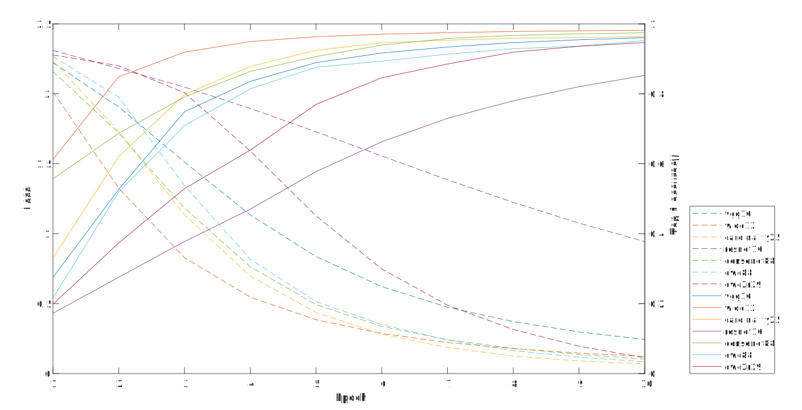

# Abnormal Driving Detection Based on DNN

[](LICENSE) [](https://github.com/Lmy0217/AbnormalDrivingDetection/pulls)

[简体中文](README_zh.md)

This implements training and testing of some models from [Abnormal Driving Detection Based on DNN](paper.pdf) by *Mingyuan Luo* and *Xi Liu*.

## Environment
- Operating system: Ubuntu 16.04 LTS
- Data would take up to 260GB disk memory
- Memory cost would be around 40GB
- Dependencies: 
  - [CUDA](https://developer.nvidia.com/cuda-toolkit) and [cuDNN](https://developer.nvidia.com/cudnn) with GPU
  - [Torch](https://github.com/torch/torch7) with packages ([nn](https://github.com/torch/nn), [cunn](https://github.com/torch/cunn), [cutorch](https://github.com/torch/cutorch), [cudnn](https://github.com/soumith/cudnn.torch)) installed by default, as well as some special packages such as [image](https://github.com/torch/image)

If you already have Torch installed, update `nn`, `cunn`, and `cudnn`.

## Prerequisites
- Download Abnormal Driving Detection
  ```bash
  git clone https://github.com/Lmy0217/AbnormalDrivingDetection.git
  cd AbnormalDrivingDetection
  ```

- Download the [State Farm Distracted Driver Detection](https://www.kaggle.com/c/state-farm-distracted-driver-detection/data) dataset and extract the zip file (imgs.zip) in the folder `dataset` (now, this folder should contain two folder named 'train' and 'test' respectively)

## Training
The training scripts come with several options, which can be listed with the `--help` flag.
```bash
th train.lua --help
```

To run the training, simply run train.lua. By default, the script runs vgg16 on dataset with 10 epochs.

To train wide12 with 20 epochs:
```bash
th train.lua -model wide12 -nEpochs 20 -batchSize 4 -LR 1e-2 -weightDecay 1e-4
```

There are a variety of the options of model, please see the folder [`models`](models).

Every epoch trained model will be saved in the folder `results/[model]` and all losses saved in `results/[model].log`.

## Testing
The testing scripts come with several options, which can be listed with the `--help` flag.
```bash
th test.lua --help
```

By default, the script tests the 0 epoch of vgg16.

To test the 11~20 epochs of wide12:
```bash
th test.lua -model wide12 -index 11 -more 10 -batchSize 8
```

Every tested result will be saved in `results/[model]_test/[model]_[epoch]_test.log`. Every log file including two lists for `k` and `Top-k`.

## Some results
The trained models with learning rate 1e-2 achieve better accuracy rates:

| Model          | Top-1 accuracy | Top-5 accuracy |
| -------------- | -------------- | -------------- |
| VGG-16         | 99.3223        | 99.9197        |
| Wide-12        | 99.3580        | 99.9643        |
| Cardinality-25 | 99.2153        | 99.9554        |
| ResNet-16      | 99.4560        | 99.9910        |
| DenseNet-88    | 99.3669        | 99.9465        |
| DWC-88         | 99.2688        | 99.9375        |
| DWCR-88**      | 9.8528         | 50.6286        |
| DWC2R-29       | 99.2331        | 99.9286        |

** DWCR-88 is failed.

The trained models with learning rate 1e-4 in 10 epochs achieve accuracy rates (dotted lines are losses and full lines are Top-1 accuracy rates):


The more details of results of trained models (learning rate = 1e-4) are saved in the folder [`ours`](ours).

## License
The code is licensed with the [MIT](LICENSE) license.