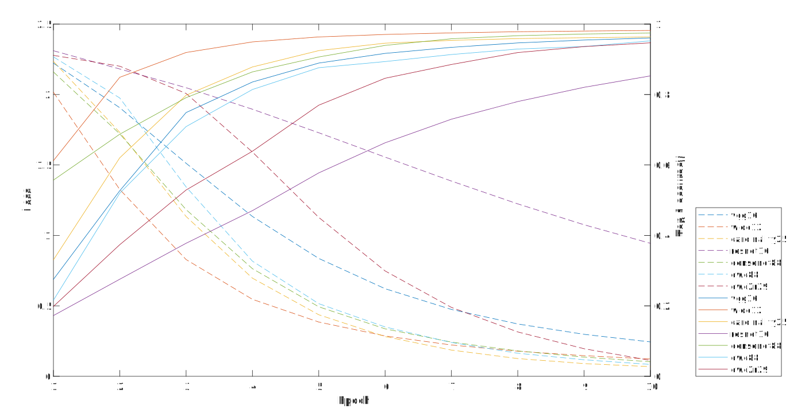

# 基于深度神经网络的非正常驾驶检测

[](LICENSE) [](https://github.com/Lmy0217/AbnormalDrivingDetection/pulls)

[English](README.md)

实现了一些模型关于 [基于深度神经网络的非正常驾驶检测](paper.pdf)（作者：*Mingyuan Luo*，*Xi Liu*）的训练和测试。

## 环境
- 系统: CentOS 7.2
- 数据会占用大约 260G 磁盘
- 内存需要大约 40GB
- 依赖：
  - 支持 GPU 并行计算的 [CUDA](https://developer.nvidia.com/cuda-toolkit) 和 [cuDNN](https://developer.nvidia.com/cudnn)
  - [Torch](https://github.com/torch/torch7) 和默认安装的包（[nn](https://github.com/torch/nn)，[cunn](https://github.com/torch/cunn)，[cutorch](https://github.com/torch/cutorch)，[cudnn](https://github.com/soumith/cudnn.torch)），非默认安装的包包括 [image](https://github.com/torch/image)

如果你已经安装好了 Torch，请更新 `nn`，`cunn` 和 `cudnn`。

## 准备
- 下载非正常驾驶检测
  ```bash
  git clone https://github.com/Lmy0217/AbnormalDrivingDetection.git
  cd AbnormalDrivingDetection
  ```

- 下载 [State Farm Distracted Driver Detection](https://www.kaggle.com/c/state-farm-distracted-driver-detection/data) 数据集并在 `datasets` 内解压文件（imgs.zip）（现在，这个文件夹内包含两个文件夹分别为 `train` 和 `test` ）

## 训练
训练脚本有多种参数选择，可以使用 `--help` 列出。
```bash
th train.lua --help
```

可直接运行 train.lua。默认情况下，脚本在数据集上训练 vgg16 模型 10 轮。

训练 wide12 模型 20 轮:
```bash
th train.lua -model wide12 -nEpochs 20 -batchSize 4 -LR 1e-2 -weightDecay 1e-4
```

模型有多种选择，请看 [`models`](models) 文件夹。

每轮训练结束模型会被保存到 `results/[model]` 文件夹，同时所有损失会被保存到 `results/[model].log`。

## 测试
测试脚本有多种参数选择，可以使用 `--help` 列出。
```bash
th test.lua --help
```

默认情况下，脚本测试 vgg16 第 0 轮模型。

测试 wide12 第 11~20 轮模型:
```bash
th test.lua -model wide12 -index 11 -more 10 -batchSize 8
```

每个测试结果会被保存到 `results/[model]_test/[model]_[epoch]_test.log`。每个结果文件包含两列分别为 `k` 和 `Top-k`。

## 部分结果
在学习率为 1e-2 时，训练模型获得的最高测试正确率：

| 模型           | Top-1 正确率    | Top-5 正确率   |
| -------------- | -------------- | -------------- |
| VGG-16         | 99.3223        | 99.9197        |
| Wide-12        | 99.3580        | 99.9643        |
| Cardinality-25 | 99.2153        | 99.9554        |
| ResNet-16      | 99.4560        | 99.9910        |
| DenseNet-88    | 99.3669        | 99.9465        |
| DWC-88         | 99.2688        | 99.9375        |
| DWCR-88**      | 9.8528         | 50.6286        |
| DWC2R-29       | 99.2331        | 99.9286        |

** DWCR-88 模型是失败的模型。

在学习率为 1e-4 时，训练模型在 10 轮内的测试正确率（虚线表示损失，实线表示 Top-1 正确率)：


训练模型测试结果的更多细节（学习率为 1e-4 时）被保存在 [`ours`](ours) 文件夹。

## 许可证
代码在 [MIT](LICENSE) 许可证下开源。